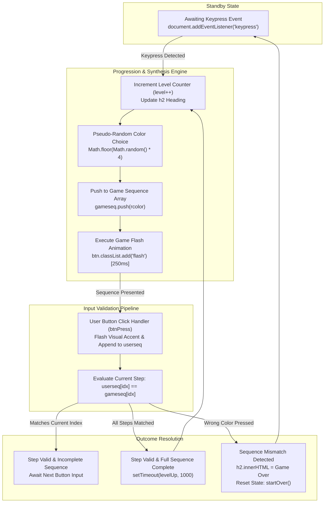

<div align="center">

# Simon Says — Interactive Memory & Pattern Engine

**Classic Sequence Memory Challenge Built with Vanilla JavaScript and Modern CSS3**

<p align="center">
  <a href="https://developer.mozilla.org/en-US/docs/Web/JavaScript"></a>
  <a href="https://developer.mozilla.org/en-US/docs/Web/HTML"></a>
  <a href="https://developer.mozilla.org/en-US/docs/Web/CSS"></a>
  <a href="#"></a>
  <a href="LICENSE"></a>
  <a href="#quickstart"></a>
</p>

<p align="center">
  Dynamic pattern sequence synthesis, real-time user input validation, and progressive difficulty escalation.<br>
  Zero build tools · Pure Vanilla JavaScript DOM manipulation · Sub-millisecond response latency.
</p>

<p align="center">
  <a href="#quick-flow">Quick Flow</a> •
  <a href="#state-machine-architecture">Architecture</a> •
  <a href="#core-gameplay-mechanics">Gameplay Mechanics</a> •
  <a href="#game-loop--state-transitions">Game Loop</a> •
  <a href="#quickstart">Quickstart</a> •
  <a href="#repository-structure">Repository Structure</a>
</p>

</div>

---

## Quick Flow

```
Keypress Start  →  Pattern Synthesis  →  Color Flash Sequence  →  User Input Validation  →  Level Escalation
```

---

## State Machine Architecture



---

## Core Gameplay Mechanics

### 01. Dynamic Sequence Generation & Escalation
* **Algorithmic Randomization**: Generates randomized pseudo-random index values mapped across 4 quadrant color tokens (`red`, `yellow`, `green`, `blue`).
* **Continuous State Array**: Preserves the complete game progression within a monotonically increasing array (`gameseq`), escalating memory requirements with each round.

### 02. Deterministic Input Verification
* **Step-by-Step Validation**: Assesses user clicks at index granularity (`userseq[idx] === gameseq[idx]`) immediately upon button down events.
* **Turn Containment**: Prevents out-of-turn interactions by managing disabled attributes until games are formally initiated.

### 03. Hardware-Accelerated Visual Feedback
* **CSS Class-Driven Animations**: Leverages discrete `.flash` and `.userflash` class toggles governed by 250ms JavaScript timeout loops for clear visual contrast between computer prompts and player clicks.
* **Color Quadrant Styling**: High-contrast quadrant layout styled with vibrant primary and secondary color palettes.

### 04. Zero-Dependency Vanilla Architecture
* **Native Browser Execution**: Requires zero package managers, compilation steps, bundlers, or runtime polyfills.
* **Universal Compatibility**: Fully executable across all modern desktop and mobile browsers via direct local file opening.

---

## Game Loop & State Transitions

| State | Trigger | Action Performed | Next State |
| :--- | :--- | :--- | :--- |
| **Idle** | Initial Page Load | Buttons disabled, waiting for keyboard input | Press any key to begin |
| **Generating** | Game Start / Level Up | Generates random color, updates level count, flashes target button | Awaiting User Input |
| **User Input** | Button Click (`click`) | Visual feedback flash, records selection in `userseq` | Evaluating Step |
| **Evaluating** | Array Index Match | Checks if `userseq[idx] === gameseq[idx]` | In Progress / Level Up / Game Over |
| **Game Over** | Input Mismatch | Displays final score (`level - 1`), resets state via `startOver()` | Idle |

---

## Quickstart

### Prerequisites
A modern web browser (Google Chrome, Mozilla Firefox, Microsoft Edge, Safari).

---

### Option 1: Direct Execution (No Installation Required)
Clone the repository and open `index.html` directly in your browser:
```bash
git clone https://github.com/tanmayythakare/simonGame.git
cd simonGame
```
*Double-click `index.html` or open it with your browser.*

---

### Option 2: Local HTTP Server
Using Python:
```bash
python -m http.server 8000
```
Open **[http://localhost:8000](http://localhost:8000)** in your browser.

Using Node.js `serve`:
```bash
npx serve .
```

---

## How to Play

1. Press **any key** on your keyboard to start the game.
2. Watch the sequence: one of the 4 colored buttons will flash.
3. Click the button that flashed to replicate the computer's choice.
4. As you advance through each level, the sequence grows longer by 1 additional color.
5. Memorize and repeat the exact sequence from memory. If you click the incorrect button, the game ends and displays your final score.

---

## Repository Structure

```
simonGame/
├── index.html          # Semantic HTML5 markup & button container layout
├── style.css           # Quadrant layout, button styling, & flash animation classes
├── app.js              # Game state engine, sequence generator, & event handlers
├── .gitignore          # Repository hygiene rules
└── README.md           # Documentation & gameplay guide
```

---

## Contributing

1. Fork the repository.
2. Clone your fork:
   ```bash
   git clone https://github.com/tanmayythakare/simonGame.git
   ```
3. Create your feature branch:
   ```bash
   git checkout -b feat/your-feature-name
   ```
4. Commit your changes:
   ```bash
   git commit -m "feat: add descriptive feature summary"
   ```
5. Push to your branch and submit a Pull Request.

---

## License

This project is open-source and distributed under the **[MIT License](LICENSE)**.

---

## Author

**Tanmay Thakare**
* GitHub: [@tanmayythakare](https://github.com/tanmayythakare)
* Email: [tanmayrthakare@gmail.com](mailto:tanmayrthakare@gmail.com)
* LinkedIn: [Tanmay Thakare](https://www.linkedin.com/in/tanmaythakare)

---

<div align="center">
  <a href="https://github.com/tanmayythakare">
    
  </a>
</div>